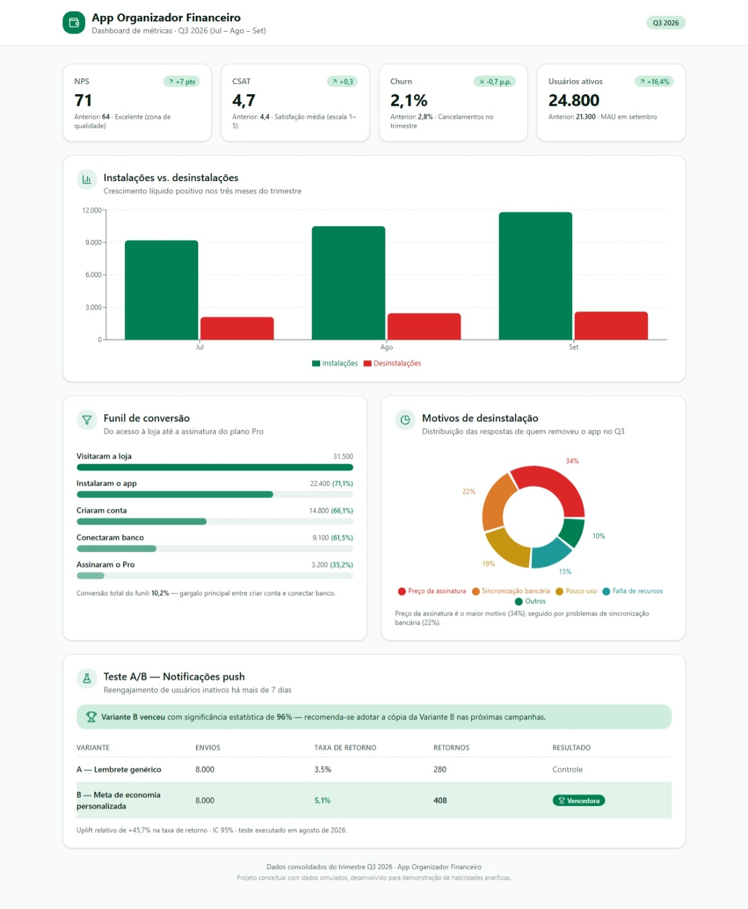

# 💰 Dashboard de Produto — App Organizador Financeiro

*Projeto conceitual com dados simulados, desenvolvido para demonstração de habilidades analíticas.*

`PRODUCT ANALYTICS` `TESTES A/B` `PRODUCT DISCOVERY` `LOVABLE` `REACT`

## 📖 Sobre

O Dashboard de métricas de produto foi desenvolvido para simular a análise trimestral (Q3-2026) de um app fictício de organização financeira, com foco em aquisição, engajamento, retenção e otimização por testes A/B, reproduzindo o tipo de análise que orienta decisões de roadmap e priorização em um time de produto.

## 🎯 Objetivos

- Consolidar indicadores-chave de produto (NPS, CSAT, Churn, usuários ativos);
- Mapear o funil de conversão e identificar gargalos;
- Validar hipóteses de produto por meio de teste A/B;
- Investigar causas de abandono (desinstalação) para orientar priorização.

## 💡 Principais Insights

- **Gargalo no funil**: 38,5% dos usuários que criaram conta não conectaram a conta bancária — esse é o maior ponto de evasão do funil.
- **Teste A/B validado**:a notificação com meta de economia personalizada (Variante B) trouxe 408 retornos de usuários inativos, contra 280 da notificação genérica (Variante A). Isso equivale a uma taxa de retorno de 5,1% (Variante B) contra 3,5% (Variante A), um ganho de 45,7%.
- **Motivo de desinstalação**: preço da assinatura lidera com 34% das respostas — esse dado demonstra a necessidade de revisar o valor percebido do plano gratuito.
- **Retenção em alta**: NPS subiu de 64 para 71 e churn caiu de 2,8% para 2,1% no trimestre, indicando sinais de maturidade do produto.

## 📊 Métricas do dashboard

- NPS / CSAT;
- Taxa de Churn;
- Usuários Ativos (DAU/MAU);
- Instalações vs. Desinstalações;
- Funil de Conversão;
- Motivos de Desinstalação;
- Teste A/B de Notificações Push.

## 🛠️ Tecnologias

- Lovable (React);
- Claude (prompts para análise de dados);
- GitHub Pages / GitHub Actions.

## 🚀 Competências demonstradas

- Análise e Priorização de Produto;
- Testes A/B e Leitura Estatística;
- Product Discovery (identificação de gargalos e causas raiz);
- Visualização e Storytelling com Dados.
- Deploy e versionamento (GitHub).
